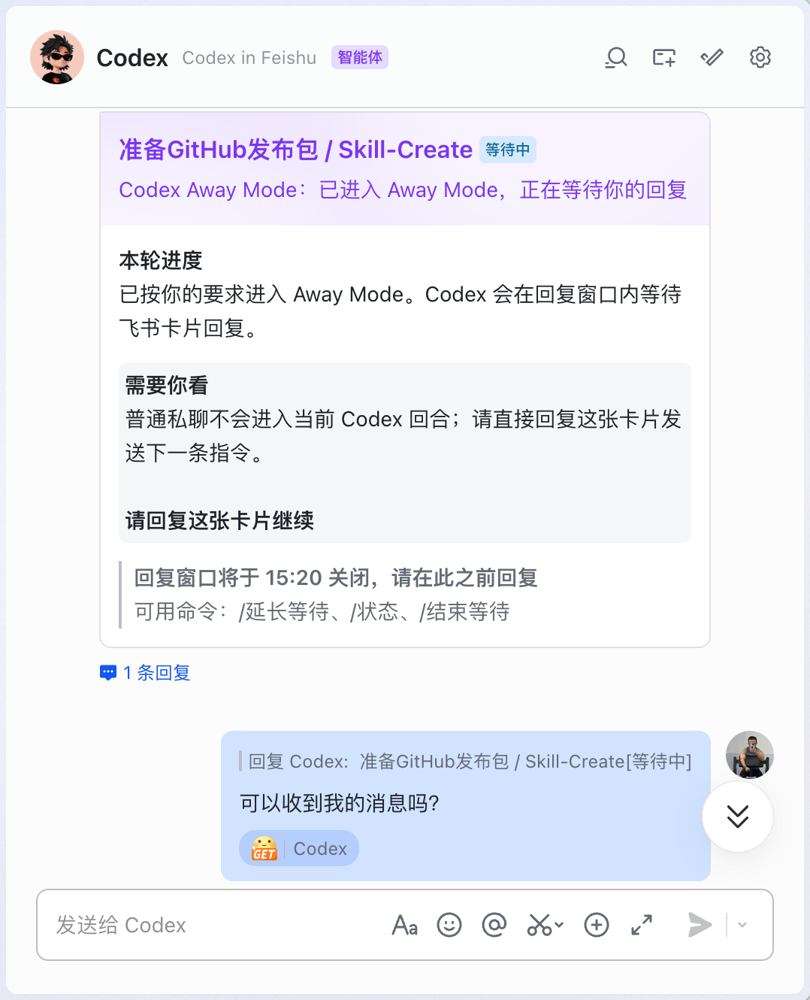
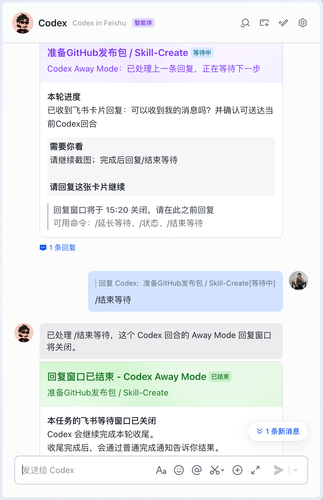
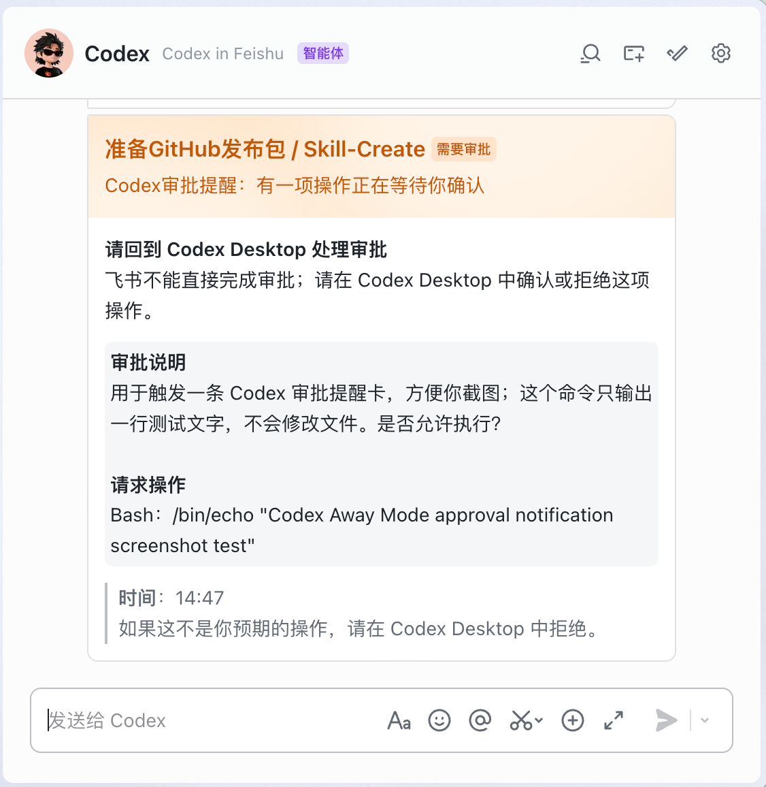
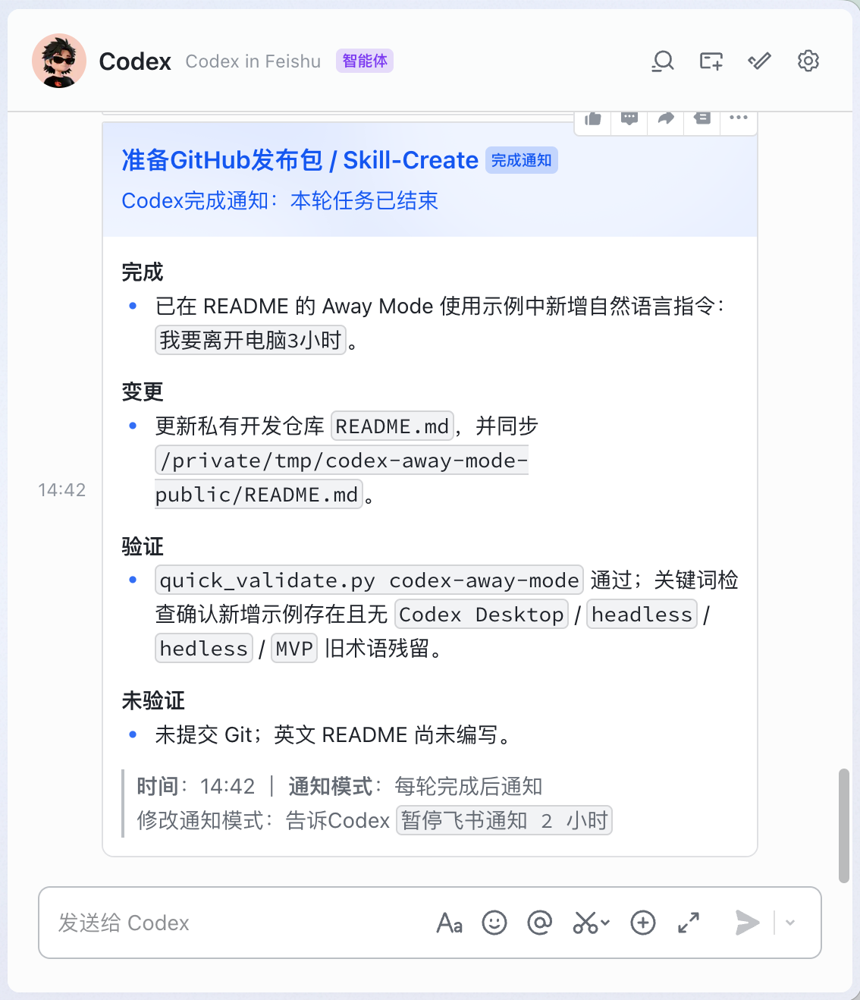

# Codex Away Mode

中文别名：Codex 离开模式。

English version: [README.en.md](README.en.md)

`Codex Away Mode` 是一个面向 Codex 桌面端应用的 Skill。它不是把 Codex 搬进飞书重新做一个远程客户端，而是把桌面版 Codex 延伸到你离开电脑的时间段：通过飞书发送完成通知、审批提醒，并在短时间窗口内等待你回复飞书卡片，把你的指令继续送回当前 Codex 会话。

这个项目当前只支持 Codex，不支持 Claude Code、Cursor、OpenCode 或其他 Agent 运行环境。

## 解决什么问题

Codex 经常会跑比较久的任务。人不在电脑前时，常见问题是：

- 任务完成了，但你不知道。
- Codex 卡在权限审批上，但你没看到。
- 你想离开电脑时继续指挥 Codex 工作，但是使用 ChatGPT 移动端连接 Codex 时速度非常慢，而且连接非常不稳定。

Codex Away Mode 解决的是这些“离开电脑后的可达性”问题。

它不是远程控制服务，也不是飞书里的 Codex 客户端。它只在当前 Codex 会话仍然活着时工作。

## 和其他类似方案的区别

很多类似项目会把 IM 当作新的主入口：通过 `codex exec` 启动一段命令行任务，或通过类似 `codex-app-server` 的服务把 Codex 暴露成一个可远程调用的会话。这样的方案适合命令型、自动化、一次性任务，但对创意型、迭代型工作不一定友好：工作现场容易从 Codex 桌面端应用被迁走，用户回到桌面时，不一定能直观地接着同一个 Codex 会话继续看上下文、审批、文件变更、视觉结果和讨论过程。

Codex Away Mode 的核心区别是：**它以 Codex 桌面端应用为主工作台，飞书只是离开电脑时的延伸层**。

- **桌面版仍然是主现场**：任务从 Codex 桌面端应用发起、运行和收尾。飞书负责提醒你发生了什么、是否需要审批、是否要补一句指令；你回到电脑后，仍然回到 Codex 桌面端应用里的同一个 Codex 会话继续工作。
- **不是另起一个无头 Codex 任务**：Away Mode 不把飞书消息变成新的 `codex exec` 执行，而是在当前 Codex 会话还活着时，把你回复对应卡片的内容送回这个 Codex 会话。
- **更适合创意型和长迭代工作**：设计、写作、产品讨论、代码审查、调试这类任务，经常需要回看上下文、观察文件、处理审批、比较结果。Codex Away Mode 的目标是让你离开时不断联，回来后不断档。
- **不要求常驻远程服务**：本工具不要求部署长期在线的 Bot server，也不把飞书做成完整远程控制台。它主要依靠 Codex Hooks、本地 CLI 和当前 Codex 会话里的等待窗口来工作。
- **边界更窄，但更稳**：它目前只支持 Codex 和飞书；通过 Codex Hooks、本地 CLI 和飞书消息接口，在 Away Mode 等待窗口内轮询卡片回复，并尽量把通知和回复路由到对应的 Codex 会话。

如果你想要的是“在 IM 里完整操作一个远程 Codex”、“把所有 Agent 都接进一个聊天入口”或“用服务器长期托管 Codex 会话”，这个项目目前不是那个方向。它更像是 Codex 桌面端应用的离开模式：你暂时离开桌面，但不离开当前工作现场。

## 截图

### Away Mode：离开电脑后继续当前会话



用户直接回复飞书卡片后，回复会回到当前 Codex 会话；Codex 处理后继续发送新的进度卡。



### 审批提醒与完成通知

当 Codex 等待桌面端审批时，飞书会发送提醒；用户仍然回到 Codex 桌面端应用处理审批。



每一轮工作结束后，Codex 会把结构化完成摘要发送到飞书。



## 功能

- **完成通知**：Codex 每一轮工作结束时，将摘要发送到飞书。
- **Away Mode**：用户离开电脑时，Codex 发一张飞书等待卡片；用户回复这张卡片后，回复会进入当前 Codex 会话。
- **多窗口路由**：多个 Codex 窗口会话同时开启 Away Mode 时，回复会尽量按飞书卡片路由到对应窗口。
- **审批提醒**：Codex 需要你在桌面端批准操作时，飞书会收到提醒。
- **通知模式**：支持默认通知、关闭通知、临时暂停通知。

## 不支持什么

- 不支持在飞书里直接审批 Codex 权限请求。你仍然需要回到 Codex 桌面端应用里确认或拒绝。
- 不支持唤醒已经结束的历史 Codex 会话。
- 不支持非 Codex Agent。
- 安装流程会尽量自动化，但飞书授权、应用配置、Codex Hook 信任仍可能需要你在浏览器或 Codex 桌面端应用中确认。

## 安装方式

最推荐的安装方式是：把这个仓库链接交给 Codex，让 Codex 读完仓库后帮你安装。

如果你使用 `skills` CLI，也可以先把 Skill 安装到 Codex：

```bash
npx skills add sudoHG/codex-away-mode --skill codex-away-mode -a codex -g
```

这一步只负责安装 Skill。飞书授权、Codex Hook（钩子）信任和端到端通知验证，仍建议让 Codex 按下面的安装流程继续完成。

你可以这样对 Codex 说：

```text
请阅读这个仓库并安装 Codex Away Mode。
安装前请说明会写入哪些全局文件。
安装过程中需要我确认飞书授权或 Codex Hook 信任时，请用中文告诉我该怎么做。
安装完成后，请运行 doctor 验证。
```

Agent 通常会执行下面这些命令：

```bash
./codex-away-mode/scripts/codex-away-mode install --dry-run --json
./codex-away-mode/scripts/codex-away-mode install --yes --json
${CODEX_AWAY_HOME:-$HOME/.codex-away-mode}/bin/codex-away-mode setup feishu --json
${CODEX_AWAY_HOME:-$HOME/.codex-away-mode}/bin/codex-away-mode doctor --e2e-notify --json
${CODEX_AWAY_HOME:-$HOME/.codex-away-mode}/bin/codex-away-mode doctor --json
```

安装器会使用经过验证的固定版本 `@larksuite/cli@1.0.57`，默认安装在：

```text
${CODEX_AWAY_HOME:-$HOME/.codex-away-mode}/npm
```

它不会依赖你系统里已有的全局 `lark-cli`，也不会默认使用不断变化的 latest 版本。

## 安装时会写入哪里

安装器会写入这些位置：

```text
${CODEX_AWAY_HOME:-$HOME/.codex-away-mode}
  程序主体、配置、安装状态、本地依赖缓存

${CODEX_HOME:-$HOME/.codex}
  Codex Skill discovery、AGENTS 托管块、Hooks 配置

${TMPDIR}/codex-away-mode/state.sqlite
  短暂运行态，例如 Away Mode 会话、卡片路由、去重记录、诊断事件
```

## 安装后的关键确认

安装完成后，你需要在 Codex 桌面端应用里信任 Hook（钩子）：

```text
设置 -> 钩子
```

英文界面是：

```text
Settings -> Hooks
```

如果没有信任 Hook（钩子），完成通知、审批提醒和 Away Mode 相关自动化可能不会生效。

可以用下面命令检查当前状态：

```bash
${CODEX_AWAY_HOME:-$HOME/.codex-away-mode}/bin/codex-away-mode doctor --json
```

`doctor --e2e-notify --json` 只能证明飞书发送链路可用；真正的 Hook（钩子）信任状态以 `doctor --json` 为准。

## 使用方式

### 完成通知

安装成功后，Codex 会在用户可见的一轮工作结束前写入完成摘要。Stop hook 会把摘要发到飞书。

Agent 会通过 `codex-away-mode notify stage-summary` 提交完成摘要。

通知默认开启。你可以直接告诉 Codex：

```text
暂停飞书通知 2 小时
```

或：

```text
关掉飞书完成通知
```

### Away Mode

当你要离开电脑时，可以告诉 Codex：

```text
开启 Codex Away Mode 30 分钟
我要离开电脑 3 小时
```

Codex 会发送一张飞书卡片。请直接回复这张卡片，不要发普通私聊。

可用命令：

```text
/延长等待
/状态
/结束等待
```

也可以用自然语言，例如：

```text
把等待时间延长 1 个小时
```

### 审批提醒

当 Codex 触发权限审批时，飞书会收到提醒。这个提醒只负责告诉你“桌面端正在等你确认”，不能替你审批。

你仍然需要回到 Codex 桌面端应用处理审批。

## 给 Agent 的入口文件

安装或排障时，Agent 应优先阅读：

- `codex-away-mode/SKILL.md`
- `codex-away-mode/references/install.md`
- `codex-away-mode/references/usage.md`
- `codex-away-mode/references/troubleshooting.md`
- `codex-away-mode/references/privacy.md`

## 项目结构

```text
codex-away-mode/
  SKILL.md              Skill 入口
  agents/openai.yaml    Skill 展示元数据
  references/           安装、使用、排障、隐私说明
  scripts/              CLI 和运行时代码

tests/                  自动化测试
```

## 验证

开发者可以运行：

```bash
pytest -q
python3 -m compileall -q codex-away-mode/scripts/codex_away_mode tests
python3 /path/to/quick_validate.py codex-away-mode
```

安装 dry-run：

```bash
./codex-away-mode/scripts/codex-away-mode install --dry-run --json
```

真实飞书授权、Codex Hook 信任、飞书卡片回复路由需要人工确认，不能只靠单元测试证明。

## 平台支持与反馈

本工具目前只在 macOS 上完成过真机测试，主要验证环境为 Codex 桌面端应用、飞书和本地 `lark-cli`。

作者本人暂无 Windows 电脑，因此 Windows 下的安装流程、Hook 信任、飞书授权、Away Mode 等待与回复路由的可靠性尚未完成真机验证。

如果你在使用中遇到问题，欢迎提交 issue，或发送邮件到 `by331works@gmail.com`。反馈时建议尽量说明：

- 操作系统和 Codex 版本。
- 飞书 / Lark 环境。
- 执行到哪一步失败。
- `codex-away-mode doctor --json` 的输出。
- 是否已经在 Codex 桌面端应用中信任 Hook。

## 隐私与安全

- 飞书 app 绑定、open id、chat id 等信息只应保存在本机配置中。
- OAuth token 和 app secret 由本地飞书 CLI 授权流程处理，不应提交到 Git。
- 运行态数据默认在 `${TMPDIR}/codex-away-mode/state.sqlite`。
- 常规飞书通知卡片不显示原始工作目录。
- PermissionRequest 卡片只是提醒，不会把 Codex 审批能力转移到飞书。
- 审批提醒可追加飞书应用内加急，但用户仍必须回到 Codex 桌面端应用处理审批。

更多说明见：

- `codex-away-mode/references/privacy.md`
- `codex-away-mode/references/troubleshooting.md`

## 许可证

MIT License。
